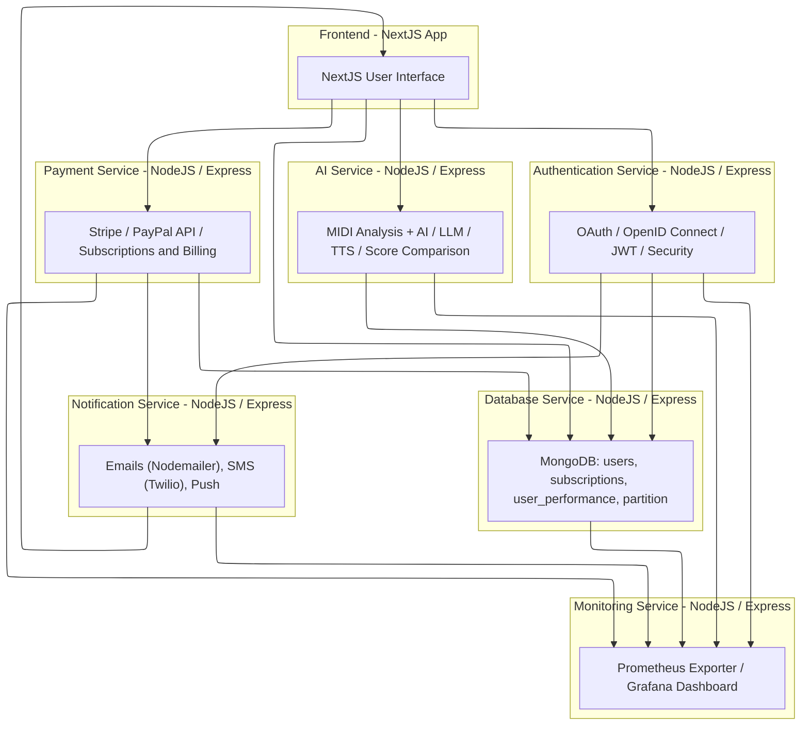
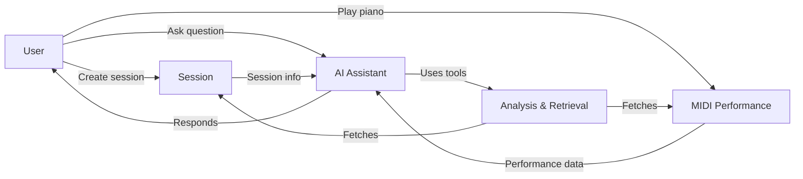
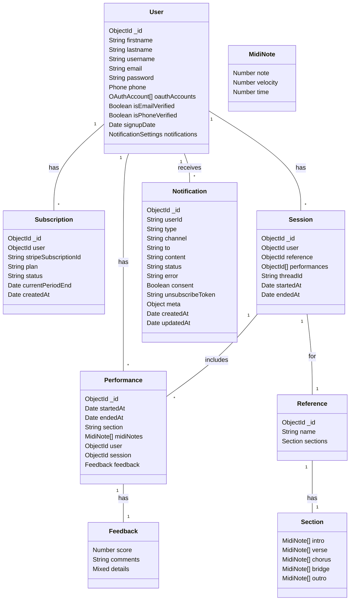

# 🎶 SonataAI — AI Platform for Piano Learning

📌 *Developed by Océane Kabasele, as part of a certifying project for the completion of a Master’s degree in Software Engineering (expected September 2025).*
⚠️ This is an academic, non-commercial project. **No external contributions are accepted.**
 
---

## 🌐 Overview

**SonataAI** is a microservices-based platform designed to analyze MIDI performances and provide AI-driven feedback and coaching.  
The system integrates real-time musical analysis, user authentication, session tracking, performance scoring, and payment handling.

The goal: deliver intelligent and personalized musical coaching using modern fullstack and AI technologies.

> The project is launched and managed via a `docker-compose` stack.

---

## 🧱 Microservice Architecture

| Service         | Description                                              | Tech Stack                      |
|-----------------|----------------------------------------------------------|----------------------------------|
| `frontend`      | Next.js web app for user interaction                     | Next.js, TypeScript, Tailwind   |
| `auth-service`  | Authentication + OAuth/JWT system                        | Node.js, Express, JWT           |
| `db-service`    | MongoDB access layer                                     | Node.js, Mongoose               |
| `ai-service`    | MIDI analysis, scoring, GPT API integration              | Node.js, OpenAI, Music libraries|
| `metrics`       | Monitoring and observability                             | Prometheus, Grafana             |
| `notifications` | Email/SMS/Push system for alerts and engagement          | Nodemailer, Twilio, Mailpit              |
| `payment`       | Subscription, invoicing and Stripe integration           | Node.js, Stripe, PayPal         |

> All services are Dockerized and orchestrated using `docker-compose`.

---

## 🚀 Getting Started

### 🔧 Prerequisites

- Docker + Docker Compose
- OpenAI Api key

### 📦 Installation

```bash
# Create a folder
mkdir SonataAI
cd SonataAI
# Clone the repositories
git clone [https://github.com/okabasele/sonataai.git](https://github.com/sonata-ai-piano-assistant/frontend.git)
Repeat the same for backend folders (authentication, database, ai, notifications, payment & metrics)

# Launch the entire stack
docker-compose up --build
````

## 📁 Repository Structure

```
SonataAI/
├── docker-compose.yml
├── frontend/
├── auth-service/
├── db-service/
├── ai-service/
├── metrics/
├── notifications/
├── payment/
└── README.md (this file)
```

---

Access points:

* 🖥️ Frontend UI: [http://localhost:3000](http://localhost:3000)
* 📬 Mailpit (Email debug): [http://localhost:8025](http://localhost:8025)
* 📈 Grafana:
    * default creds: admin/admin
* 🛠️ Prometheus: 

> You can configure env variables for each service in their respective `.env` files.

---

## 🔍 Project Diagrams

### 🧭 Architecture Overview



---

## 🧠 AI Pipeline



---

## 📊 UML Entities



---

## 🧪 Testing & Monitoring

Prometheus and Grafana provide service-level dashboards.

Future additions:

* Unit testing in each backend services
* Cypress tests for frontend
* Load testing for AI & auth
* Linting and CI/CD pipelines (GitHub Actions)

---

## 📜 License

MIT © Océane Kabasele 2025
